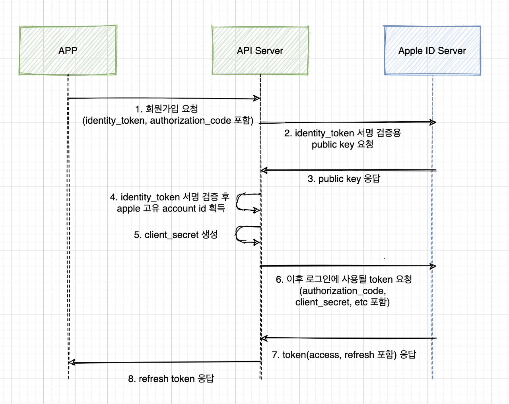

# kevin-dev-oauth-apple-v1


## 📋 Index
- [About](#🎉-about)
- [Overview](#👀-overview)
- [Getting Started](#🚀-getting-started)
- [Release Notes](#✅-release-notes)
- [Issues](#🔥-issues)
- [Contributing](#👥-contributing)
- [Authors](#👤-authors)
- [License](#🏷-license)
- [References](#📚-references)
- [Commit Message (Gitmoji)](#✉️-commit-messages-gitmoji)

## 🎉 About
Apple 소셜 로그인을 구현한 프로젝트입니다. 클라이언트에서 전달해주는 'access_token' 혹은 'refresh_token'을 검증하여 유저의 정보를 가져오는데에 목적을 가지고 있습니다.

## 👀 Overview
* Apple Login
  * 로그인 화면 리다이렉트 (getRedirectUri)
  * 'id_token'을 public key로 사용자 정보 가져오기 (getUserId)
  * Private key를 이용하여 client_secret을 만들고 다른 정보들과 취합하여 Apple로 부터 'refresh_token' 발급 (getAccessToken)
  
## 🚀 Getting Started

**로그인 프로세스**


REST API 서버에서는 로그인 화면 연동에 대한 처리가 필요없습니다. 실제로 연동할 때는 클라이언트에서 로그인까지 완료하고 'access_token'을 API 서버에 전달해주는 프로세스가 진행되어야 합니다.
여기서는 테스트를 위해 웹 환경을 구성하고 로그인 화면으로 리디렉션을 할 수 있는 주소를 출력해내는 형태로 진행했습니다.

**dependencies**
```
implementation group: 'io.jsonwebtoken', name: 'jjwt', version: '0.9.1'
implementation group: 'org.bouncycastle', name: 'bcpkix-jdk15on', version: '1.69'
implementation group: 'org.springframework.cloud', name: 'spring-cloud-openfeign-core', version: '3.0.3'
```

### 🔹 Apple
Apple 로그인(https://appleid.apple.com/auth/authorize) 이 성공하면 Apple ID Server로 부터 'state, code, id_token, user(최초 1회만 출력됨)'의 정보를 받아옵니다.

'id_token'은 JWT 형식으로 이루어져 있으며 유저의 정보(Apple 고유 계정 ID, email, 등)를 payload에 담고 있습니다. ('id_token' 10분, 'authorizationCode' 5분 뒤에 만료)

'id_token'의 payload에 속한 값들이 변조되지 않았는지 검증하기 위해서는 Apple 서버의 public key(https://appleid.apple.com/auth/keys) 를 이용하여 JWS E256 signature를 검증해야합니다. (기본 검증은 코드상에서는 생략)
'id_token'의 헤더의 값 중, kid와 alg에 매칭되는 public key로 서명을 검증해야 합니다.

### 🔹 AWS
- EC2
- Route53 (+SSL)
- ALB

```
sudo yum install -y git 
sudo yum install -y java-1.8.0-openjdk-devel.x86_64 
git clone https://github.com/ozofweird/kevin-dev-oauth-apple-v2.git 
cd kevin-dev-oauth-apple 
sudo chmod +x gradlew 
sudo ./gradlew clean build 
cd build/libs 
sudo nohup java -jar kevin-dev-oauth-apple-0.0.1-SNAPSHOT.jar &
```

### 🔹 Project Structures
```
└── src
    ├── main
    │   ├── java
    │   │   └── com
    │   │       └── example
    │   │           ├── api
    │   │           │   └── AppleController.java
    │   │           ├── config.oauth
    │   │               ├── dto
    │   │               │   ├── AppleAccessTokenRes.java
    │   │               │   ├── ApplePublicKeyRes.java
    │   │               │   └── AppleUserInfoRes.java
    │   │               └── AppleService.java
```

## ✅ Release Notes
* 0.0.1
    * 테스트

## 🔥 Issues
- 토큰 검증에 대한 코드 생략
- Private key 저장 위치에 대한 고려
- 회원 탈퇴 시나리오에 따른 oauth 연결 해제에 대한 고려
  - 앱 내에서의 회원 탈퇴 (유저 회원 탈퇴 -> DB 삭제/비활성화 -> 특정 기간 후 -> 연결 해제)
  - Apple 계정에서 직접 탈퇴 (Apple 탈퇴 -> DB 삭제/비활성화)


## 👥 Contributing
ozofweird

## 👤 Authors
- [ozofweird](https://github.com/ozofweird) - **Kevin Ahn**

## 🏷 License
ozofweird

## 📚 References
- [kevin-dev-oauth-apple-v2](https://github.com/ozofweird/kevin-dev-oauth-apple-v2.git)
- [스프링 프로젝트에 애플 로그인 API 연동](https://whitepaek.tistory.com/61)
- [스프링 프로젝트에 애플 로그인 API 연동(Github)](https://github.com/WHITEPAEK/demo-sign-in-with-apple)
- [Spring API 서버에서 Apple 인증(로그인, 회원가입) 처리하기](https://hwannny.tistory.com/71)
- [애플 Apple 로그인 iOS 서버 2중 인증](https://eeyatho.tistory.com/23)
- [애플로 로그인 (자바스크립트, 스프링) 완벽 파헤치기](https://developer111.tistory.com/58?category=948844)
- [Adding Apple Sign In To Spring Boot App(JAVA) Backend Part](https://medium.com/tekraze/adding-apple-sign-in-to-spring-boot-app-java-backend-part-e053da331a)
- [Sign In with Apple: Backend Part (Java)](https://medium.com/jeff-tech/sign-in-with-apple-id-backend-part-java-70dc9aa2c9a)

Apple 공식 문서
- [Incorporating Sign in with Apple into Other Platforms](https://developer.apple.com/documentation/sign_in_with_apple/sign_in_with_apple_js/incorporating_sign_in_with_apple_into_other_platforms#overview)
- [Generate and Validate Tokens](https://developer.apple.com/documentation/sign_in_with_apple/generate_and_validate_tokens)
- [Verifying a User](https://developer.apple.com/documentation/sign_in_with_apple/sign_in_with_apple_rest_api/verifying_a_user)
- https://appleid.apple.com/auth/keys

---

## ✉️ Commit messages (Gitmoji)

|Gitmoji|Code|Description|
|:-----:|:---:|:--------:|
|🎨|art|파일/코드 구조 개선|
|🩹|adhesive_bandage|간단한 수정|
|⚡️|zap|성능 향상|
|🔥️|fire|코드나 파일 삭제|
|🐛️|bug|버그 해결|
|🚑️|ambulance|긴급 수정|
|✨️|sparkles|새로운 기능|
|📝️|memo|문서 추가/수정|
|💄️|lipstick|화면 UI 추가/수정|
|🎉️|tada|프로젝트 시작|
|✅️|white_check_mark|테스트 추가/수정|
|🔒️|lock|보안 이슈 수정|
|🔖️|bookmark|릴리즈/버전 태그|
|🚧|construction|작업 진행 중|
|💚|green_heart|CI 빌드 수정|
|⬇️|arrow_down|의존성 버전 다운|
|⬆️|arrow_up|의존성 버전 업|
|📌|pushpin|특정 버전 의존성 고정|
|👷|construction_worker|CI 빌드 시스템 추가/수정|
|📈|chart_with_upwards_trend|분석, 추적 코드 추가/수정|
|♻️|recycle|코드 리팩토링|
|➕|heavy_plus_sign|의존성 추가|
|➖|heavy_minus_sign|의존성 제거|
|🔧|wrench|설정 파일 추가/수정|
|🔨|hammer|개발 스크립트 추가/수정|
|🌐|globe_with_meridians|다국어 지원|
|💩|poop|안좋은 코드 추가|
|⏪|rewind|변경 내용 되돌리기|
|🔀|twisted_rightwards_arrows|브랜치 합병|
|👽|alien|외부 API 변화로 인한 수정|
|🚚|truck|리소스 이동/이름 변경|
|💥|boom|놀라운 기능 소개|
|🍱|bento|에셋 추가/수정|
|💡|bulb|주석 추가/수정|
|💬|speech_balloon|스트링 파일 추가/수정|
|🗃|card_file_box|데이버베이스 관련 수정|
|🔊|loud_sound|로그 추가/수정|
|🔇|mute|로그 삭제|
|📱|iphone|반응형 디자인|
|🙈|see_no_evil|gitignore 추가|
